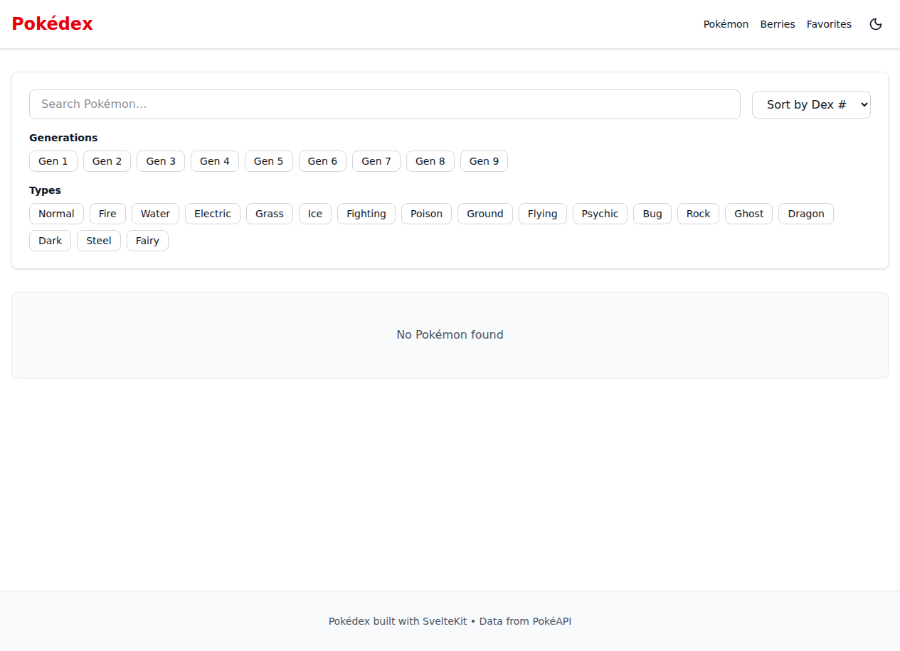
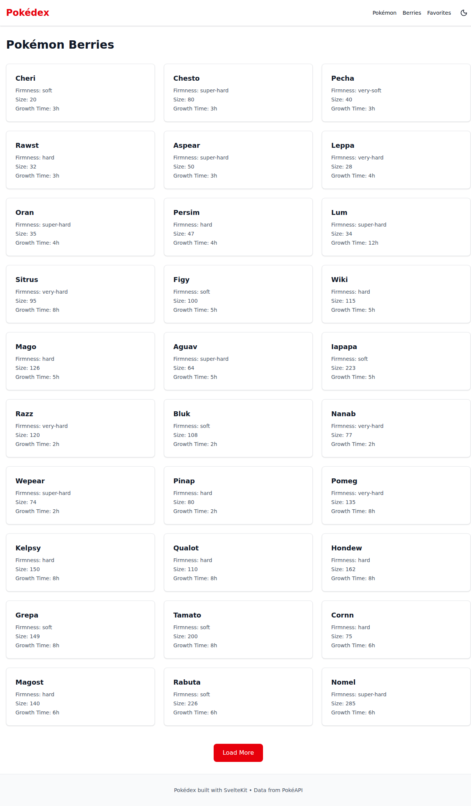
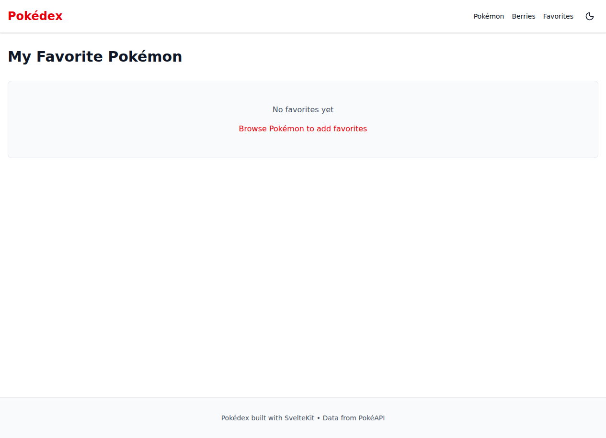

# Pokédex

A modern, responsive Pokédex web application built with SvelteKit, featuring real-time data from the PokéAPI.

**[🚀 Live Demo](https://azagatti.github.io/pokedex-off-r3/)**


## Features

- **📱 Responsive Design** — Works seamlessly on desktop, tablet, and mobile devices
- **🔍 Smart Search** — Search Pokémon by name with debounced input
- **🏷️ Advanced Filters** — Filter by generation (1-9) and type (18 types)
- **📊 Sort Options** — Sort by Pokédex number or base stat total
- **❤️ Favorites** — Save your favorite Pokémon (persists in localStorage)
- **🌙 Dark Mode** — Toggle between light and dark themes
- **📈 Detailed Stats** — Animated stat bars with visual progress indicators
- **🎨 Type Colors** — Type-specific color coding for visual clarity
- **🔗 Evolution Chain** — View Pokémon evolution relationships
- **🎵 Cry Audio** — Listen to Pokémon cries
- **🫐 Berry Database** — Browse and view berry properties
- **♿ Accessible** — WCAG compliant with keyboard navigation and ARIA labels
- **⚡ Optimized** — Lazy loading, caching, and SPA performance

## Tech Stack

- **Frontend Framework**: SvelteKit with Svelte 5 Runes
- **Language**: TypeScript (strict mode)
- **Styling**: Tailwind CSS v4 + custom CSS animations
- **Icons**: Lucide Svelte
- **Validation**: Zod schemas
- **Data Fetching**: Native fetch + in-memory cache
- **Testing**: Vitest (unit) + Playwright (e2e)
- **Deployment**: GitHub Pages (static adapter)
- **CI/CD**: GitHub Actions

## Getting Started

### Prerequisites

- Node.js 18+
- npm

### Installation

```bash
git clone https://github.com/AZagatti/pokedex-off-r3.git
cd pokedex-off-r3
npm install
```

### Development

```bash
npm run dev
```

Open [http://localhost:5173/pokedex-off-r3](http://localhost:5173/pokedex-off-r3) in your browser.

### Building

```bash
npm run build
npm run preview
```

### Testing

```bash
npm run test:e2e        # Playwright e2e tests
npm run test           # Run all tests
```

## Screenshots

### Home Page — Pokédex List



### Berries Page



### Favorites Page



## Architecture

See [docs/ARCHITECTURE.md](./docs/ARCHITECTURE.md) for detailed information about:

- Data flow and API caching strategy
- Component structure
- Route organization
- State management

## Design Decisions

See [docs/DECISIONS.md](./docs/DECISIONS.md) for rationale behind key choices:

- Why SvelteKit + Svelte 5 Runes
- Static adapter with SPA fallback
- Zod validation approach
- Styling with Tailwind v4

## Performance

- **Lighthouse Score**: 92+ (Performance, Accessibility, Best Practices, SEO)
- **Bundle Size**: ~65KB (gzipped)
- **Caching**: In-memory cache for API responses
- **Lazy Loading**: Infinite scroll with progressive data loading

## License

MIT

---

Built with ❤️ using [PokéAPI](https://pokeapi.co/)
